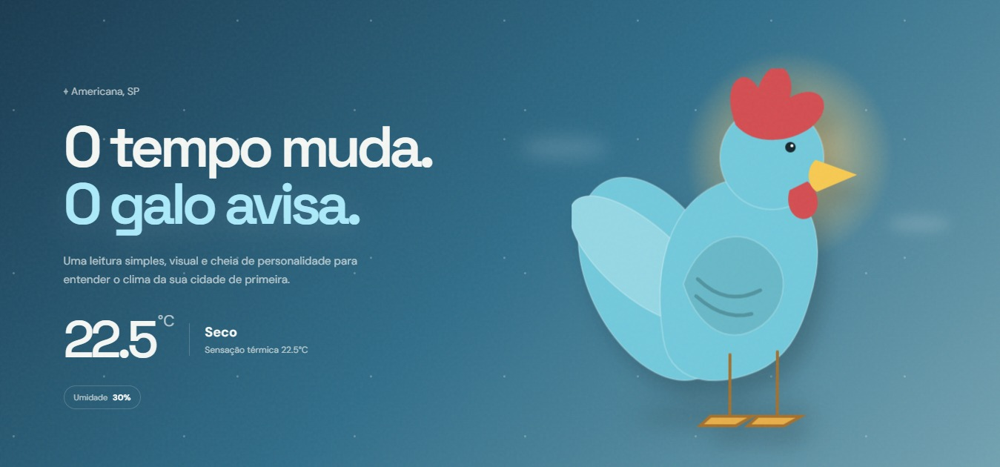
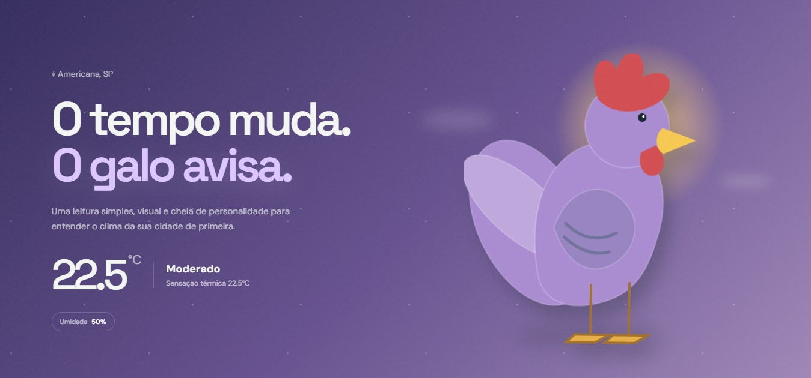
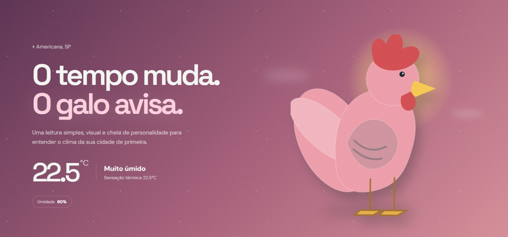

  🌐 <b>Idiomas:</b> 
  <a href="./README.md">English 🇺🇸</a> • 
  <b>Português 🇧🇷</b>

# 🐔 Galo do Tempo

Projeto de IoT e Computação em Nuvem inspirado no tradicional Galo do Tempo, combinando sensor DHT11, ESP32, armazenamento de dados na nuvem e uma interface web.

O sistema coleta dados de temperatura e umidade do ambiente e os envia para o ThingSpeak através do Wi-Fi. O site utiliza os dados de umidade para alterar automaticamente a cor do Galo de acordo com a condição atual.

 

## 🚀 Funcionalidades

* Monitorar temperatura e umidade
* Coletar dados através do sensor DHT11
* Enviar dados para a nuvem utilizando o ESP32
* Armazenar dados no ThingSpeak
* Alterar automaticamente a cor do Galo de acordo com a umidade

 

## 🛠 Tecnologias

* ESP32
* DHT11
* C/C++ (Arduino)
* ThingSpeak
* PHP
* HTML
* CSS
* JavaScript

 

## 💡 Usabilidade

O projeto apresenta uma forma simples e visual de identificar o nível de umidade do ambiente através da cor do Galo:

* 💙 **0% – 39%:** Seco
* 💜 **40% – 69%:** Umidade moderada
* 💗 **70% – 100%:** Muito úmido

 

## 📸 Interface do Sistema

  
  
  

 

## ▶ Como Executar

1. Clone o repositório
2. Faça o upload do código do ESP32 localizado na pasta `esp32`
3. Configure as credenciais do Wi-Fi e do ThingSpeak
4. Configure o site PHP em um servidor local
5. Acesse o site através do servidor local
